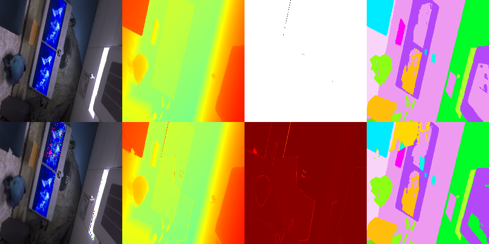
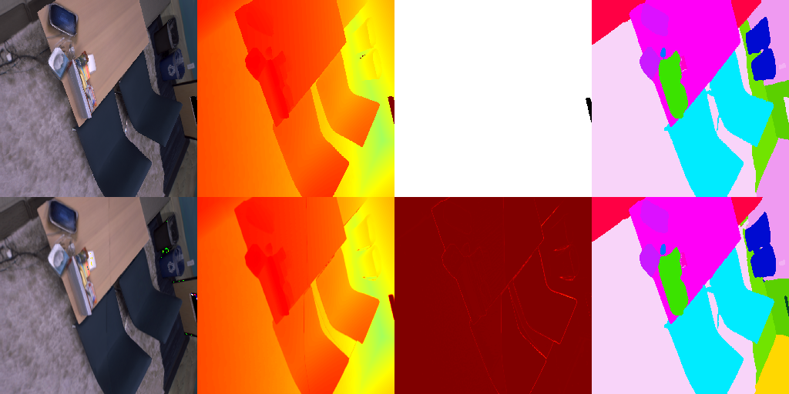
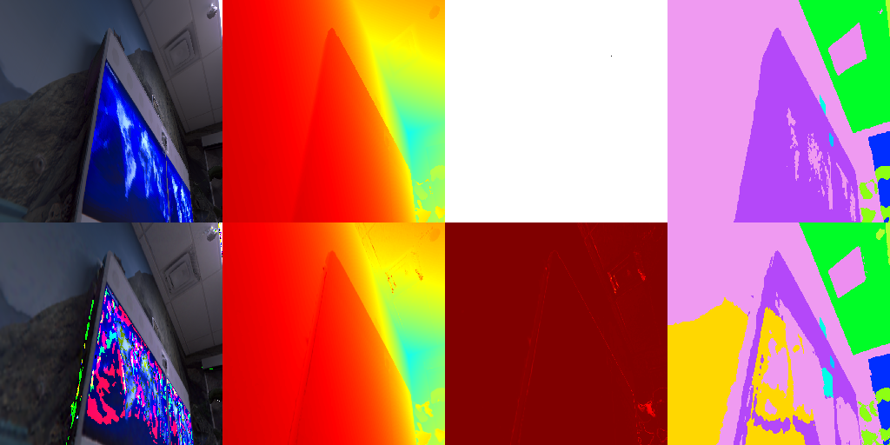

# ActiveSGM + Qwen Planner

This repository extends ActiveSGM with an LLM-assisted, metric-guarded
next-best-view planner. It is a stage-one research and engineering release:
the baseline ActiveSGM pipeline remains responsible for candidate scoring, and
Qwen is only used to resolve uncertain Top-3 choices under explicit numeric
constraints.

## Project Evolution

1. **ActiveSGM baseline**: semantics-driven active mapping with a SplaTAM
   backbone.
2. **Qwen Planner extension**: candidate logging, constrained Top-3 selection,
   offline analysis, log-only evaluation, and guarded application mode.
3. **Current stage**: software-side validation on Replica `office0`; hardware
   integration and drone deployment are future work.

## Guarded Planner

The extension does not let the LLM replace the original planner.

1. ActiveSGM computes candidate metrics and weighted scores.
2. When the leading candidates are close, Qwen selects only from the Top-3.
3. A hard guard checks score ratio, exploration ratio, and distance change.
4. In **log-only** mode, the Qwen decision is recorded but never applied.
5. In **apply** mode, a guard-approved decision can replace `next_visit` only
   when the explicit application switch is enabled.

This design keeps the LLM contribution inspectable and makes it possible to
compare a logged baseline with a guarded trajectory change.

## Stage-One Evidence

The public experiment summary compares a Qwen log-only run with a guarded apply
run on Replica `office0`.

| Run | ATE RMSE | PSNR | Depth RMSE | LPIPS | Trajectory changes |
| --- | ---: | ---: | ---: | ---: | ---: |
| Qwen log-only | 122.69 cm | 27.75 | 0.53 cm | 0.092 | 0 |
| Guarded apply | 120.37 cm | 27.68 | 0.83 cm | 0.088 | 6 |

The result is **mixed rather than a full improvement**: the guarded apply run
changed the path and improved ATE/LPIPS in this comparison, while depth metrics
worsened. The current claim is therefore limited to demonstrating that
metric-guarded LLM assistance can influence the planning trajectory; improving
the guard policy remains open work.

## Selected Outputs

Each image shows an `office0` observation with RGB, depth-related rendering,
and semantic views. These are selected presentation assets, not a full result
dump.

| Log-only reference | Guarded apply at a corresponding early step | Guarded apply at a later changed-decision region |
| --- | --- | --- |
|  |  |  |

More context, exact run statistics, limitations, and next steps are in
[docs/PROJECT_PROGRESS.md](docs/PROJECT_PROGRESS.md).

## Repository Contents

- `src/`: ActiveSGM pipeline, Qwen planner, reranker, visualization, and data
  interfaces.
- `configs/`: Replica, NARUTO, and runtime configurations.
- `scripts/`: installation and launch helpers.
- `envs/`: dependency lists and Docker environment material.
- `run_*.sh`, `test_*.sh`: focused stage-one run and unit-test entry points.
- `analysis_*.py`, `offline_*.py`, `notes_*.txt`: offline analysis and research
  records for the planner extension.

## Reproducibility Scope

This repository deliberately contains source code and compact documentation
only. It does **not** redistribute third-party source trees, datasets, model
weights, checkpoints, full experiment outputs, caches, logs, or local
environments. See `envs/` and the run scripts for setup requirements. The
baseline data preparation follows the original ActiveSGM/Habitat instructions.

For a first baseline run, the repository also retains the lightweight framework
wrappers under `scripts/framework/`.

## Status and Next Work

Completed work includes planner integration, guarded decision logic, log-only
and apply-mode scripts, offline analysis, and stage-one Replica `office0`
evidence. Next work includes stricter guard tuning, more controlled experiments,
environment migration, and second-stage integration with a drone platform.

## Attribution

This repository is a learning and engineering adaptation of
[lly00412/ActiveSGM](https://github.com/lly00412/ActiveSGM), which is released
under the MIT License. The original project builds on HabitatSim, ActiveGAMER,
OneFormer, SplaTAM, Semantic Gaussians, and SGS-SLAM. Their licenses and
attribution remain applicable.
